 

 

## 🧭 About Me

<table align="center">
<tr>
<td>

- 🔭 Currently building projects across **full-stack web dev** and **data science**
- 🌱 Deepening my skills in **machine learning** and **cloud-scale data pipelines**
- 💡 I like turning messy datasets into clear, usable insight
- ⚡ Fun fact: I'd rather refactor at midnight than leave a `TODO` behind

</td>
</tr>
</table>

---

## 🛠️ Tech Stack

**Languages**
 

**Web & Backend**
 

**Data & ML**
 

**Databases & Tools**
 

---

## 📊 GitHub Stats

  

  

---

## 🐍 Contribution Snake

<picture>
  <source media="(prefers-color-scheme: dark)" srcset="https://raw.githubusercontent.com/Oscarv2005/Oscarv2005/output/github-snake-dark.svg" />
  <source media="(prefers-color-scheme: light)" srcset="https://raw.githubusercontent.com/Oscarv2005/Oscarv2005/output/github-snake.svg" />
  
</picture>

---

  

  

**Thanks for stopping by — always open to interesting projects and a good conversation about data.**

